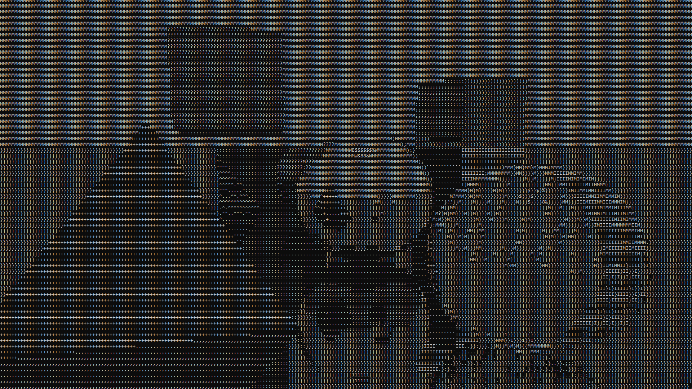

# Console Ray Tracing

Ray tracing algorithm that creates a 3D image in the console in real time.

## Real ray tracing in real time

The algorithm generates a 3D image in the console using a gradient of ASCII characters. This happens in real time so you can control the camera and choose the best angle. By using ray tracing algorithm and gradient of 70 different characters a very realistic 3D image can be rendered.

## Refraction & reflection

The effects of reflection and refraction are calculated according to physical laws, which makes them realistic. You can change the reflectivity of the surfaces, for example, to make them mirrored. Also you can create completely transparent object. In this case, the light passing through it will be refracted according to the laws of optics.

## Polygon rendering

Polygon rendering is supported. You can create 3D models yourself or use ready-made functions for quick rendering of pyramids and prisms with convenient settings of parameters such as position, number of faces and height. The intersection of the ray with each of the polygons of the object is calculated only if the ray has an intersection with an invisible sphere inside which the polygonal object is located. This technology significantly improves the performance of the program.

## Animations

You can create an animation for each object in the scene. This allows you to dynamically change the properties of an object, such as position, and size. Also you can rotate objects or move them in a circular orbit.

